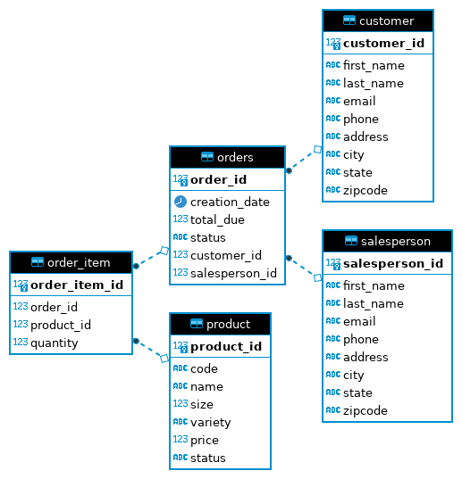

# Introduction
The JDBC App of the Core Java project has been implemented to utilize the JDBC API to execute an assortment of queries on a PostgreSQL
database that has been provisioned by Docker. The application performs various CRUD (create, read, update, and delete) operations on the database.

Technologies utilized:
- Java
- PostgreSQL
- Docker
- Maven
- DBeaver

# Implementation
## ER Diagram


## Design Patterns
Two accepted design patterns typically used for accessing databases in Java include the Data Access Object (DAO) and the Respository design patterns.
Both of these aforementioned design patterns serve the purpose of isolating the application/business layer from the persistence layer, but subtly vary
from one another. The JDBC App implements the Data Access Object pattern.\
\
**Data Access Object**: provides CRUD functionality by executing transactions against a given database. The Data Access Object is table-centric and lies close
to the underlying storage, and is typically utilized when working with a centralized database.\
\
**Repository**: Focuses on single table access per class. The repository pattern is designed to sit at a higher layer than the Data Access Object design pattern, one that closer to the business logic of an application. This design pattern is typically utilized when database is highly normalized or for distributed database systems.

# Test

Verify hplussport database creation.\
Test result: pass.
```
postgres=# \l

                                 List of databases
   Name    |  Owner   | Encoding |  Collate   |   Ctype    |   Access privileges   
-----------+----------+----------+------------+------------+---------------------
hplussport | postgres | UTF8     | en_US.utf8 | en_US.utf8 | =Tc/postgres         
```

Verify table creation.\
Test result: pass.
```
postgres=# \dt

           List of relations
 Schema |    Name     | Type  |  Owner   
--------+-------------+-------+----------
 public | customer    | table | postgres
 public | order_item  | table | postgres
 public | orders      | table | postgres
 public | product     | table | postgres
 public | salesperson | table | postgres
```

Verify data insertion.\
Test result: pass.
```
JDBCExecutor:
CustomerDAO customerDAO = new CustomerDAO(connection);
Customer customer = new Customer();
customer.setFirstName("George");
customer.setLastName("Washington");
customer.setEmail("george.washington@wh.gov");
customer.setPhone("(555) 123-4567");
customer.setAddress("1234 Main st");
customer.setCity("Mount Vernon");
customer.setState("VA");
customer.setZipCode("22121");
customerDAO.create(customer);

PSQL:
SELECT * FROM customer
WHERE first_name='George' and last_name='Washington'


customer_id | first_name | last_name  |           email          |      phone     |    address    |     city     | state | zipcode
 
------------+------------+------------+--------------------------+----------------+---------------+--------------+-------+---------
    10000   | George     | Washington | george.washington@wh.gov | (555) 123-4567 |  1234 Main st | Mount Vernon | VA    | 22121

```

Verify data update.\
Test result: pass.
```
JDBCExecutor:
Connection connection = dcm.getConnection();
CustomerDAO customerDAO = new CustomerDAO(connection);
Customer customer = customerDAO.findById(10000);
System.out.println(customer.getFirstName() + " " + customer.getLastName() + " " + customer.getPhone());
customer.setPhone("(555) 765-4321");
customer = customerDAO.update(customer);
System.out.println(customer.getFirstName() + " " + customer.getLastName() + " " + customer.getPhone());

Output:
George Washington (555) 123-4567
George Washington (555) 765-4321
```

Verify data deletion.\
Test result: pass.
```
JDBCExecutor:
Connection connection = dcm.getConnection();
CustomerDAO customerDAO = new CustomerDAO(connection);
Customer customer = customerDAO.findById(10000);
customerDAO.delete(customer);

PSQL:
SELECT * FROM customer
where first_name='George' and last_name='Washington';

 customer_id | first_name | last_name | email | phone | address | city | state | zipcode 
-------------+------------+-----------+-------+-------+---------+------+-------+---------
(0 rows)
```
